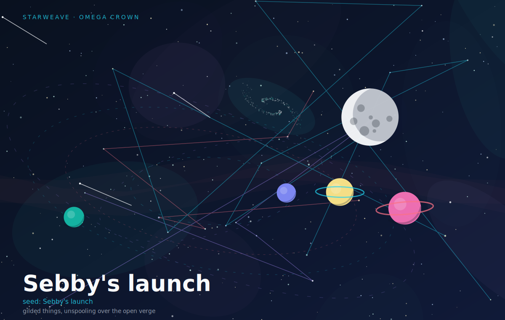

# Starweave

Starweave turns any phrase into a **deterministic** SVG space poster. The same
seed always produces the same universe — so a poster is fully described by its
seed, and you can regenerate it from the metadata baked into the file.



It's pure standard-library Python at runtime (no dependencies), and it can emit
static posters, **self-contained animated SVGs**, **seed families**, and **HTML
contact-sheet galleries**.

## The idea

A seed phrase doesn't draw a picture directly. It expands into a **World** — a
small bundle of facts (a mood, intensity knobs, which celestial features exist,
a generated catalogue name) plus a factory of independent random streams. A
stack of **Layers** then paints that world onto an SVG document:

```
 seed ── sha256 ──▶  World ────────────────▶  Scene (layer stack) ──▶  SVG
                    │ mood, density,          │ background, nebula,     │ static
                    │ turbulence,             │ clusters, blackhole,    │ animated
                    │ features{galaxy,moon,   │ supernova, galaxy,      │ gallery
                    │  blackhole,supernova…}  │ orbits, stars, planets, │ batch
                    │ name "Sigma Lyrae"      │ moon, horizon, title
                    └ stream("stars") …
```

Two properties fall out of that design:

- **Reproducible** — `(seed, palette, variant)` fully determines the poster.
  The world summary and generation params are embedded in the SVG `<metadata>`.
- **Composable** — every layer draws from its *own* named RNG stream
  (`world.stream("stars")`), so adding, dropping, or reordering layers never
  changes another layer's output. The galaxy looks identical whether or not a
  black hole is drawn.

## Quick start

```bash
python3 -m starweave "Sebby's launch" --palette aurora --out poster.svg
```

Install the CLI:

```bash
python3 -m venv .venv && source .venv/bin/activate
python3 -m pip install -e .
starweave "late night code" --palette auto --out poster.svg --open
```

## Things to try

```bash
# Animated SVG — twinkling stars, drifting nebulae, orbiting planets.
starweave "midnight compiler" --palette synthwave --animate --out anim.svg

# Let the seed choose its own signature palette.
starweave "tidal lock" --palette auto

# A contact sheet of 9 deterministic variants of one phrase.
starweave "deep field" --gallery 9 --out gallery.html --open

# One poster per built-in palette, side by side.
starweave "deep field" --gallery-palettes --out palettes.html

# Seed family: 12 related posters (base#0 … base#11) + index.html
starweave batch "deep field" --count 12 --out family/

# Export the world as JSON (no render), or dump + render together.
starweave "orbit coffee" --dump-world world.json
starweave "orbit coffee" --dump-world world.json --out poster.svg

# Swatch strip of every built-in palette.
starweave palette-preview --out palettes.svg

# Seed-space morph: walk the path between two phrases.
starweave "ember tide" --morph "glacial drift" --frames 9 --out morph.html

# A self-contained web explorer — type a phrase, morph, save the SVG. No deps.
starweave --explorer --out web/explorer.html

# Hear the seed: deterministic WAV from the same World.
starweave "the long quiet between stars" --sonify --seconds 12 --out song.wav

# Terminal star-art (denser ramp; width via --ascii-width or --cols).
starweave "the long quiet between stars" --ascii --ascii-width 90

# Force or drop layers (blackhole, supernova, nebula_clusters, …).
starweave "singularity" --without comets,grid
starweave "minimal" --only background,stars,blackhole,title

# Reproduce any poster from its embedded metadata.
starweave --reproduce poster.svg --out again.svg
```

Some seeds host a **black hole** (event horizon + photon ring + accretion disk),
a **supernova remnant**, denser **nebula clusters**, a **strange attractor**, or
an **L-system filament** — each on its own stream so the rest of the sky never
jitters when a feature flips.

A prebuilt explorer lives at [`web/explorer.html`](web/explorer.html). Inspect a
seed with:

```bash
starweave "the long quiet between stars" --describe
starweave "orbit coffee" --myth
```

## CLI reference

| Flag / command | Meaning |
| --- | --- |
| `seed` | Phrase used to generate the poster. |
| `--out PATH` | Output file (`.svg`, or `.html` for galleries). |
| `--width` / `--height` | Canvas size (default 1440×900). |
| `--stars` / `--planets` | Counts (the world scales density around these). |
| `--palette NAME` | One of the built-ins, or `auto` to pick from the seed. |
| `--variant N` | A different deterministic draw of the same seed. |
| `--animate` | Emit an animated SVG (twinkle / drift / orbit). |
| `--only A,B` / `--without A,B` | Include or exclude layers by name. |
| `--gallery [N]` | HTML contact sheet of N seed variants (default 6). |
| `--gallery-palettes` | Gallery with one poster per palette. |
| `--quiet` | Hide gallery/batch progress on stderr. |
| `--morph SEED_B [--frames N]` | Interpolate seed-space from the seed to `SEED_B`. |
| `--explorer` | Write a self-contained interactive web explorer (HTML). |
| `--sonify [--seconds N]` | Render the seed as a deterministic WAV tune. |
| `--ascii [--ascii-width N]` | Terminal star-art (`--cols` is an alias). |
| `--describe` | Print the seed's world as JSON and exit. |
| `--dump-world FILE` | Write world JSON to FILE (no render unless `--out` too). |
| `--myth` | Print the constellation's generated origin myth. |
| `--reproduce FILE` | Regenerate a poster from an SVG's embedded metadata. |
| `--title` / `--no-title` | Override or hide the poster title. |
| `--list-palettes` / `--list-layers` | Discoverability. |
| `batch BASE --count N --out DIR` | Seed family `BASE#0`…`BASE#N-1` + index HTML. |
| `palette-preview --out FILE` | SVG swatch strip of every palette. |

Ten palettes ship in the box: `aurora`, `ember`, `midnight`, `solar`, `rose`,
`noir`, `synthwave`, `glacier`, `verdant`, `gilded` — plus `auto`.

## Library use

```python
from starweave import render_poster, World

svg = render_poster("late night code", palette="auto", animate=True)

world = World.from_seed("late night code", "auto")
print(world.name, world.summary()["features"])
```

## Project layout

```
src/starweave/
  world.py           seed -> World (mood, knobs, features, name, RNG streams)
  layers.py          composable Layer classes painted back-to-front
  scene.py           World + layers -> SvgDoc
  svg.py             SVG document builder
  palette.py         ten palettes + deterministic "auto"
  palette_preview.py swatch-strip SVG for all palettes
  batch.py           seed-family rendering
  naming.py          catalogue names, captions, myths
  gallery.py         many posters on one HTML page
  ascii_art.py       terminal star-art
  cli.py             argument parsing and file output
```

## Development

```bash
python3 -m pip install -e . -q
python3 -m pytest tests/ -q
# or: PYTHONPATH=src python3 -m unittest discover -s tests
```

CI runs the suite on Python 3.10–3.13 and smoke-tests the CLI on every push.

## Changelog

See [CHANGELOG.md](CHANGELOG.md).

## License

MIT — see [LICENSE](LICENSE).
